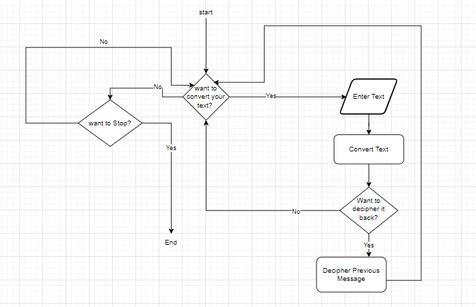
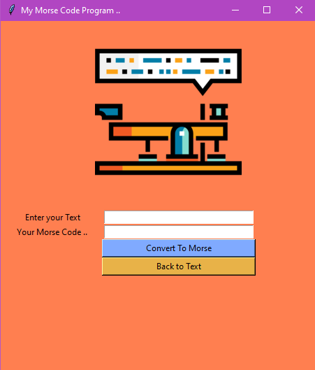

# Morse Code Converter

This is a Morse Code converter that converts from and to Morse Code.

### Description

1. prompts the user(interactive) to enter their text.
2. prompts the user if the want to decipher the Morse code back to its original form.

### Versions
* Text Based Converter(Python Scripting).

     
* GUI Based Converter
using Tkinter.

     

### Acknowledgments
* [flaticon](https://www.flaticon.com/free-icon/morse-code_390591?term=morse%20code&page=1&position=10&page=1&position=10&related_id=390591&origin=tag) For the icon.
* draw.io for flow chart.

### License
@ Rana Hafez 2022

